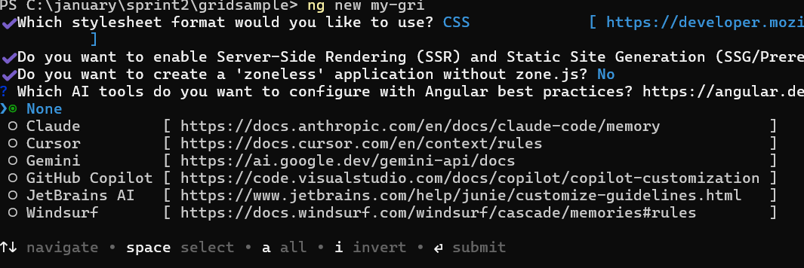

# Getting started with Angular Toolbar component

This section explains how to create a simple **Toolbar** using Angular and configure Toolbar items like button, separator and input components.

## Dependencies

Install the required dependency package to use the `Toolbar` component in your application.

```javascript
|-- @syncfusion/ej2-angular-navigations
    |-- @syncfusion/ej2-base
    |-- @syncfusion/ej2-angular-base
    |-- @syncfusion/ej2-navigations
        |-- @syncfusion/ej2-buttons
        |-- @syncfusion/ej2-popups
```

## Setup Angular Environment

You can use [`Angular CLI`](https://github.com/angular/angular-cli) to setup your Angular applications.
To install Angular CLI use the following command.

```bash
npm install -g @angular/cli
```

> **Angular 21 Standalone Architecture:** Standalone components are the default in Angular 21. This guide uses the modern standalone architecture. If you need more information about the standalone architecture, refer to the [Standalone Guide](https://ej2.syncfusion.com/angular/documentation/getting-started/angular-standalone).

### Installing a specific version

To install a particular version of Angular CLI, use:

```bash
npm install -g @angular/cli@21.0.0
```

## Create a new application

With Angular CLI installed, execute this command to generate a new application:

```bash
ng new syncfusion-angular-app
```

* This command will prompt you to configure settings like enabling Angular routing and choosing a stylesheet format.

```bash

? Which stylesheet format would you like to use? (Use arrow keys)
> CSS             [ https://developer.mozilla.org/docs/Web/CSS                     ]
  Sass (SCSS)     [ https://sass-lang.com/documentation/syntax#scss                ]
  Sass (Indented) [ https://sass-lang.com/documentation/syntax#the-indented-syntax ]
  Less            [ http://lesscss.org                                             ]

```

* By default, a CSS-based application is created. Use SCSS if required:

```bash
ng new syncfusion-angular-app --style=scss
```

* During project setup, when prompted for the Server-side rendering (SSR) option, choose the appropriate configuration.


* Select the required AI tool or 'none' if you do not need any AI tool.



* Navigate to your newly created application directory:

```bash
cd syncfusion-angular-app
```

> Note: In Angular 19 and below, it uses `app.component.ts`, `app.component.html`, `app.component.css` etc. In Angular 20+, the CLI generates a simpler structure with `src/app/app.ts`, `app.html`, and `app.css` (no `.component.` suffixes).

## Installing Syncfusion<sup style="font-size:70%">&reg;</sup> Toolbar Package

Syncfusion<sup style="font-size:70%">&reg;</sup> packages are distributed in npm as `@syncfusion` scoped packages. You can get all the Angular Syncfusion<sup style="font-size:70%">&reg;</sup> package from npm [link]( https://www.npmjs.com/search?q=%40syncfusion%2Fej2-angular- ).

Currently, Syncfusion<sup style="font-size:70%">&reg;</sup> provides two types of package structures for Angular components,
1. Ivy library distribution package [format](https://angular.dev/tools/libraries/angular-package-format)
2. Angular compatibility compiler(Angular's legacy compilation and rendering pipeline) package.

### Ivy library distribution package

Syncfusion<sup style="font-size:70%">&reg;</sup> Angular packages(`>=20.2.36`) has been moved to the Ivy distribution to support the Angular [Ivy](https://docs.angular.lat/guide/ivy) rendering engine and the package are compatible with Angular version 12 and above. To download the package use the below command.

Add [`@syncfusion/ej2-angular-navigations`](https://www.npmjs.com/package/@syncfusion/ej2-angular-navigations/v/20.2.38) package to the application.

```bash
npm install @syncfusion/ej2-angular-navigations --save
```

### Angular compatibility compiled package(ngcc)

For Angular version below 12, you can use the legacy (ngcc) package of the Syncfusion<sup style="font-size:70%">&reg;</sup> Angular components. To download the `ngcc` package use the below.

Add [`@syncfusion/ej2-angular-navigations@ngcc`](https://www.npmjs.com/package/@syncfusion/ej2-angular-navigations/v/20.2.38-ngcc) package to the application.

```bash
npm install @syncfusion/ej2-angular-navigations@ngcc --save
```

To mention the ngcc package in the `package.json` file, add the suffix `-ngcc` with the package version as below.

```bash
@syncfusion/ej2-angular-navigations:"20.2.38-ngcc"
```

>Note: If the ngcc tag is not specified while installing the package, the Ivy Library Package will be installed and this package will throw a warning.

## Add Toolbar component

Modify the template in [src/app/app.component.ts] file to render the toolbar component.
Add the Angular Toolbar by using `<ejs-toolbar>` selector in **template** section of the app.component.ts file.

```typescript
import { ToolbarModule } from '@syncfusion/ej2-angular-navigations'
import { Component } from '@angular/core';

@Component({
imports: [
  ToolbarModule
],
standalone: true,
selector: 'app-root',
// specifies the template string for the Toolbar component
template: `<ejs-toolbar>
          <e-items>
             <e-item text='Cut'></e-item>
             <e-item text='Copy'></e-item>
             <e-item text='Paste'></e-item>
             <e-item type='Separator'></e-item>
             <e-item text='Bold'></e-item>
             <e-item text='Italic'></e-item>
             <e-item text='Underline'></e-item>
          </e-items>
        </ejs-toolbar>`
})
export class AppComponent { }

```

## Adding CSS reference

The following CSS files are available in `../node_modules/@syncfusion` package folder.
This can be referenced in [src/styles.css] using following code.

```css
@import '../node_modules/@syncfusion/ej2-base/styles/material3.css';  
@import '../node_modules/@syncfusion/ej2-buttons/styles/material3.css';  
@import '../node_modules/@syncfusion/ej2-popups/styles/material3.css';  
@import '../node_modules/@syncfusion/ej2-navigations/styles/material3.css';

```

* Now, run the application in the browser using the following command.

  ```shell
  npm start
  ```

The following code example shows how to initialize the Toolbar on a single element.










  


## Initialize the Toolbar using HTML elements

The Toolbar component can be rendered based on the given HTML element using `<ejs-toolbar>`.
This approach provides more flexibility for custom styling and complex layouts when the standard item configuration is not sufficient.
You need to follow the below structure of HTML elements to render the Toolbar inside the `<ejs-toolbar>` tag.

```html
   <ejs-toolbar>   --> Root Toolbar Element
    <div>      --> Toolbar Items Container
       <div>   --> Toolbar Item Element
       </div>
    </div>
  </ejs-toolbar>
```










  


## See Also

* [How to add Toggle Button](./how-to/add-toggle-button)

N> You can refer to our [Angular Toolbar](https://www.syncfusion.com/angular-components/angular-toolbar) feature tour page for its groundbreaking feature representations. You can also explore our [Angular Toolbar Example](https://ej2.syncfusion.com/angular/demos/#/fabric/toolbar/default) that shows you how to render the Toolbar in Angular.