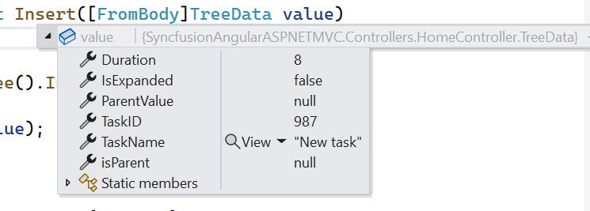
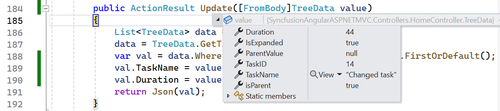
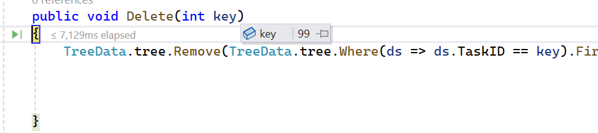
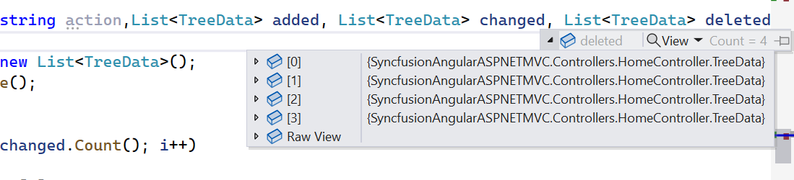
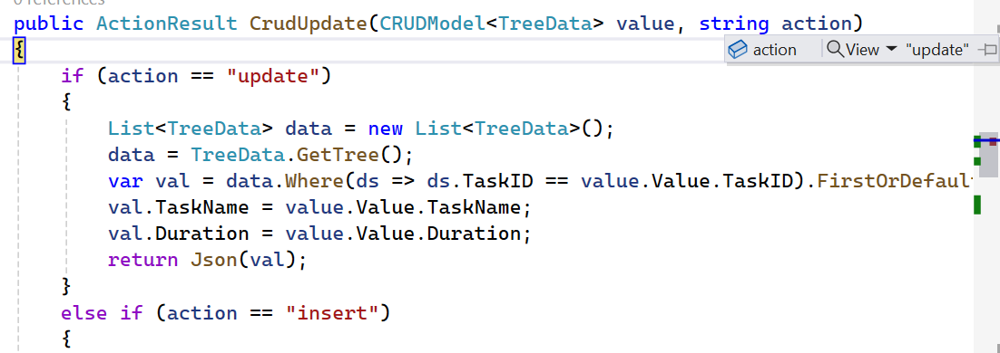
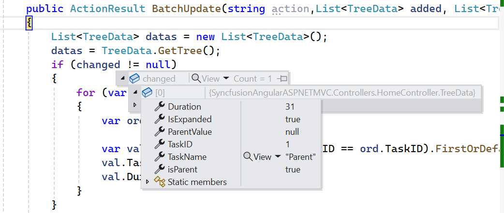
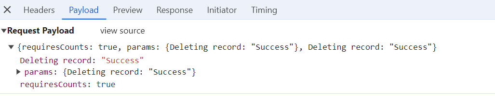

# Persisting data in server in Angular TreeGrid component

Edited data in the TreeGrid component can be persisted to a database via RESTful web services.

All CRUD operations in the TreeGrid are performed using [DataManager](../../data), which provides options for binding and persisting data to the server side.

> The ODataAdaptor persists data on the server according to the OData protocol.

You can also view a video tutorial about persisting data on the server.



The following sections explain how to get edited data details on the server side using [UrlAdaptor](../../data/adaptors/#url-adaptor) and other available adaptors with the `dataManager` property. See the [adaptors documentation](https://ej2.syncfusion.com/angular/documentation/data/adaptors) for details.

## Using URL adaptor

Use the [UrlAdaptor](../../data/adaptors/#url-adaptor) of [DataManager](../../data) to bind data from a remote service. The initial data load and subsequent CRUD actions can be managed through various URL properties of the DataManager.

When using `UrlAdaptor`, operations such as paging, filtering, sorting, and editing should be handled on the server.

CRUD operations can be mapped to server-side controller actions using **insertUrl**, **removeUrl**, **updateUrl**, **crudUrl**, and **batchUrl**.

> Refer to this section for handling only CRUD operations on the [server side](https://ej2.syncfusion.com/angular/documentation/treegrid/editing/persisting-data-in-server#remote-save-adaptor).

Example for DataManager configuration with CRUD URLs:

```typescript
import { Component, OnInit } from '@angular/core';
import { DataManager, UrlAdaptor } from '@syncfusion/ej2-data';
import { EditSettingsModel, ToolbarItems } from '@syncfusion/ej2-angular-treegrid';

@Component({
    selector: 'app-container',
    template: `<ejs-treegrid [dataSource]='data'  [toolbar]='toolbarOptions' [treeColumnIndex]='1'      height='270' [editSettings]='editSettings' idMapping='TaskID' parentIdMapping='parentID' hasChildMapping='isParent' >
        <e-columns>
            <e-column field='TaskID' headerText='Task ID' width='90' textAlign='Right'></e-column>
            <e-column field='TaskName' headerText='Task Name' width='170'></e-column>
            <e-column field='StartDate' headerText='Start Date' width='130' format="yMd" textAlign='Right' editType='datepickeredit'></e-column>
            <e-column field='EndDate' headerText='End Date' width='130' format="yMd" textAlign='Right' editType='datepickeredit'></e-column>
            <e-column field='Progress' headerText='Progress' width='100' textAlign='Right'></e-column>
        </e-columns>
    </ejs-treegrid>`
})
export class AppComponent implements OnInit {

    public data: DataManager;
    public editSettings: EditSettingsModel;
    public toolbarOptions: ToolbarItems[];

    public dataManager: DataManager = new DataManager({
        url: "Home/DataSource",
        updateUrl: "Home/Update",
        insertUrl: "Home/Insert",
        removeUrl: "Home/Delete",
        batchUrl: "Home/Remove",
        adaptor: new UrlAdaptor
    });

    ngOnInit(): void {
        this.data = this.dataManager;
        this.editSettings = { allowEditing: true, allowAdding: true, allowDeleting: true, newRowPosition: 'Below', mode: 'Row' };
        this.toolbarOptions = ['Add', 'Edit', 'Delete', 'Update', 'Cancel'];
    }
}
```

When using `UrlAdaptor`, return the data as JSON from the controller action. The JSON must contain a `result` property for the data and a `count` property for total records.

Example controller action:

```typescript
public ActionResult DataSource(DataManager dm)
{
    var DataSource = TreeData.GetTree();
    DataOperations operation = new DataOperations();
    if (dm.Where != null && dm.Where.Count > 0)
    {
        DataSource = operation.PerformFiltering(DataSource, dm.Where, "and");   //perform filtering  and maintain child records on Expand/Collapse operation
    }
    var count = DataSource.ToList<TreeData>().Count();
    if (dm.Skip != 0)
    {
        DataSource = operation.PerformSkip(DataSource, dm.Skip);   //Paging
    }
    if (dm.Take != 0)
    {
        DataSource = operation.PerformTake(DataSource, dm.Take);
    }
    return dm.RequiresCounts ? Json(new { result = DataSource, count = count }) : Json(DataSource);
}
```

> [See URL adaptor with CRUD operation sample on GitHub.](https://github.com/SyncfusionExamples/CRUD-action-using-URLadaptor-in-angular-tree-grid/)

### Insert record

Use **insertUrl** to point to the controller action for inserting a record. The example below illustrates handling insertion at a specific position using [newRowPosition](https://ej2.syncfusion.com/angular/documentation/api/treegrid/editSettings/#newrowposition).

```typescript
public void Insert(TreeGridData value, int relationalKey)
{
    var i = 0;
    for (; i < TreeData.tree.Count; i++)
    {
        if (TreeData.tree[i].TaskID == relationalKey)
        {
            break;
        }
    }
    i += FindChildRecords(relationalKey); // Inserted new record when newRowPosition API is in "Below".
    TreeData.tree.Insert(i + 1, value);
}

public int FindChildRecords(int id)
{
    var count = 0;
    for (var i = 0; i < TreeData.tree.Count; i++)
    {
        if (TreeData.tree[i].ParentItem == id)
        {
            count++;
            count += FindChildRecords(TreeData.tree[i].TaskID);
        }
    }
    return count;
}
```

The newly added record details are bound to the `value` parameter, and `relationalKey` contains the primaryKey value of a selected record, which helps to find the position of the newly added record. Refer to the following screenshot.



### Update record

Use **updateUrl** to map update/save operations.

```typescript
public ActionResult Update(TreeGridData value)
{
    var val = TreeData.tree.Where(ds => ds.TaskID == value.TaskID).FirstOrDefault();
    val.TaskName = value.TaskName;
    val.StartDate = value.StartDate;
    val.Duration = value.Duration;
    val.Priority = value.Priority;
    val.Progress = value.Progress;
    return Json(value);
}
```

The updated record details are bound to the `value` parameter. Refer to the following screenshot.



### Delete record

Use **removeUrl** for the delete operation.

```typescript
public ActionResult Delete(int key)
{
    TreeData.tree.Remove(TreeData.tree.Where(ds => ds.TaskID == key).FirstOrDefault());
}
```

The deleted record primary key value is bound to the `key` parameter. Refer to the following screenshot.



Child records are also deleted when a parent is removed:



### CRUD URL

Use **crudUrl** to manage all CRUD operations in a single controller action.

Example usage:

```typescript
import { Component } from '@angular/core';
import { DataManager, UrlAdaptor } from '@syncfusion/ej2-data';
import { EditSettingsModel, ToolbarItems } from '@syncfusion/ej2-angular-treegrid';
@Component({
  selector: 'app-root',
  template: `
  <ejs-treegrid [dataSource]='data' [treeColumnIndex]='1' height='400' [toolbar]='toolbarOptions' [editSettings]='editSettings' idMapping='TaskID' parentIdMapping='ParentValue' hasChildMapping='isParent' >
                <e-columns>
                  <e-column field='TaskID' headerText='Task ID' width='90' textAlign='Right'></e-column>
                  <e-column field='TaskName' headerText='Task Name' width='180'></e-column>
                  <e-column field='Duration' headerText='Duration' width='80' textAlign='Right'></e-column>
                </e-columns>
               </ejs-treegrid>
 `,
})
export class AppComponent {
  public data: DataManager = new DataManager({
    adaptor: new UrlAdaptor,
    url: "Home/Datasource",
    crudUrl: 'Home/CrudUpdate',
  });
  public editSettings: EditSettingsModel={ allowEditing: true, allowAdding: true, allowDeleting: true, newRowPosition: 'Below', mode: 'Row' };;
  public toolbarOptions: ToolbarItems[] = ['Add', 'Edit', 'Delete', 'Update', 'Cancel'];
}
```

Server controller CRUD handler:

```typescript
public ActionResult CrudUpdate(CRUDModel<TreeData> value, string action)
{
    if (action == "update")
    {
        List<TreeData> data = new List<TreeData>();
        data = TreeData.GetTree();
        var val = data.Where(ds => ds.TaskID == value.Value.TaskID).FirstOrDefault();
        val.TaskName = value.Value.TaskName;
        val.Duration = value.Value.Duration;
        return Json(val);
    }
    else if (action == "insert")
    {
        var c = 0;
        for (; c < TreeData.GetTree().Count; c++)
        {
            if (TreeData.GetTree()[c].TaskID == value.RelationalKey)
            {
                if (TreeData.GetTree()[c].isParent == null)
                {
                    TreeData.GetTree()[c].isParent = true;
                }
                break;
            }
        }
        c += FindChildRecords(value.RelationalKey);
        TreeData.GetTree().Insert(c + 1, value.Value);

        return Json(value.Value);
    }
    else if (action == "remove")
    {
        TreeData.GetTree().Remove(TreeData.GetTree().Where(or => or.TaskID == int.Parse(value.Key.ToString())).FirstOrDefault());
        return Json(value);
    }
    return Json(value.Value);
}
```

Refer to the following screenshot to know about the action parameter.



> If both **insertUrl** and **crudUrl** are specified, only **insertUrl** is used for adding records.

### Batch URL

The **batchUrl** property is specific to batch editing. Map this to the controller action for processing batch CRUD actions.

Example DataManager and controller configuration:

```typescript
import { Component } from '@angular/core';
import { DataManager, UrlAdaptor } from '@syncfusion/ej2-data';
import { EditSettingsModel, ToolbarItems } from '@syncfusion/ej2-angular-treegrid';
@Component({
  selector: 'app-root',
  template: `
  <ejs-treegrid [dataSource]='data' [treeColumnIndex]='1' height='400' [toolbar]='toolbarOptions' [editSettings]='editSettings' idMapping='TaskID' parentIdMapping='ParentValue' hasChildMapping='isParent' >
                <e-columns>
                  <e-column field='TaskID' headerText='Task ID' width='90' textAlign='Right'></e-column>
                  <e-column field='TaskName' headerText='Task Name' width='180'></e-column>
                  <e-column field='Duration' headerText='Duration' width='80' textAlign='Right'></e-column>
                </e-columns>
               </ejs-treegrid>
 `,
})
export class AppComponent {
  public data: DataManager = new DataManager({
    adaptor: new UrlAdaptor,
    url: "Home/Datasource",
    batchUrl: 'Home/BatchUpdate',
  });
  public editSettings: EditSettingsModel={ allowEditing: true, allowAdding: true, allowDeleting: true, newRowPosition: 'Below', mode: 'Batch' };;
  public toolbarOptions: ToolbarItems[] = ['Add', 'Edit', 'Delete', 'Update', 'Cancel'];
}
```

```typescript

 public ActionResult BatchUpdate(string action,List<TreeData> added, List<TreeData> changed, List<TreeData> deleted, int? key)
 {
     List<TreeData> datas = new List<TreeData>();
     datas = TreeData.GetTree();
     if (changed != null)
     {
         for (var i = 0; i <changed.Count(); i++)
         {
             var ord = changed[i];
             
             var val = datas.Where(ds => ds.TaskID == ord.TaskID).FirstOrDefault();
             val.TaskName = ord.TaskName;
             val.Duration = ord.Duration;
         }
     }
     if (deleted != null)
     {
         for (var i = 0; i < deleted.Count(); i++)
         {
             datas.Remove(datas.Where(or => or.TaskID == deleted[i].TaskID).FirstOrDefault());
         }
     }
     if (added != null)
     {
         for (var i = 0; i < added.Count(); i++)
         {
             datas.Insert(0, added[i]);
         }
     }
     var data = datas.ToList();
     return Json(data);

 }
 
```



## Remote save adaptor

Use the RemoteSaveAdaptor to persist only CRUD operations on the server, while handling other actions locally. Assign the data source to the **json** property and set the **RemoteSaveAdaptor** in the **adaptor** property. CRUD operations map using **updateUrl**, **insertUrl**, **removeUrl**, and **batchUrl**.

Example using RemoteSaveAdaptor:

```typescript
import { Component, OnInit } from '@angular/core';
import { DataManager, RemoteSaveAdaptor } from '@syncfusion/ej2-data';
import { EditSettingsModel, ToolbarItems } from '@syncfusion/ej2-angular-treegrid';

@Component({
    selector: 'app-container',
    template: `<ejs-treegrid [dataSource]='data'  [toolbar]='toolbarOptions' [treeColumnIndex]='1' height='270' [editSettings]='editSettings' hasChildMapping='isParent' idMapping='TaskID' parentIdMapping='parentID' >
        <e-columns>
            <e-column field='TaskID' headerText='Task ID' width='90' textAlign='Right'></e-column>
            <e-column field='TaskName' headerText='Task Name' width='170'></e-column>
            <e-column field='StartDate' headerText='Start Date' width='130' format="yMd" textAlign='Right' editType='datepickeredit'></e-column>
            <e-column field='EndDate' headerText='End Date' width='130' format="yMd" textAlign='Right' editType='datepickeredit'></e-column>
            <e-column field='Progress' headerText='Progress' width='100' textAlign='Right'></e-column>
        </e-columns>
    </ejs-treegrid>`
})
export class AppComponent implements OnInit {

    public data: DataManager;
    public value: any;
    public editSettings: EditSettingsModel;
    public toolbarOptions: ToolbarItems[];
    ngOnInit(): void {
        this.value = (window as any).griddata;
        this.data = new DataManager({
            json: JSON.parse(this.value),
            updateUrl: "Home/Update",
            insertUrl: "Home/Insert",
            removeUrl: "Home/Delete",
            batchUrl: "Home/Remove",
            adaptor: new RemoteSaveAdaptor();
        });
        this.editSettings = { allowEditing: true, allowAdding: true, allowDeleting: true, newRowPosition: 'Below', mode: 'Row' };
        this.toolbarOptions = ['Add', 'Edit', 'Delete', 'Update', 'Cancel'];
    }
}
```

Fetch data from `ViewBag`:

```
    <script type="text/javascript">
       window.griddata = '@Html.Raw(Json.Encode(ViewBag.dataSource))';
    </script>
```

Controller handling CRUD operations with RemoteSaveAdaptor:

```typescript
public ActionResult Index(DataManager dm)
{
   var data = TreeData.GetTree();
   ViewBag.dataSource = data;
   return View();
}

public void Insert(TreeData value, int relationalKey)
{
    var i = 0;
    for (; i < TreeData.tree.Count; i++)
    {
        if (TreeData.tree[i].TaskID == relationalKey)
        {
            break;
        }
    }
    i += FindChildRecords(relationalKey); // Inserted new record when newRowPosition API is in "Below".
    TreeData.tree.Insert(i + 1, value);
}

public ActionResult Update(TreeData value)
{
    var val = TreeData.tree.Where(ds => ds.TaskID == value.TaskID).FirstOrDefault();
    val.TaskName = value.TaskName;
    val.StartDate = value.StartDate;
    val.Duration = value.Duration;
    val.Priority = value.Priority;
    val.Progress = value.Progress;
    return Json(value);
}

public ActionResult Delete(int key)
{
    TreeData.tree.Remove(TreeData.tree.Where(ds => ds.TaskID == key).FirstOrDefault());
}

// Remove method (batchUrl) is triggered when deleting a parent record.
public ActionResult Remove(List<TreeGridData> changed, List<TreeGridData> added, List<TreeGridData> deleted)
{
    for (var i = 0; i < deleted.Count; i++)
    {
        TreeData.tree.Remove(TreeData.tree.Where(ds => ds.TaskID == deleted[i].TaskID).FirstOrDefault());
    }
}
```

> [See RemoteSaveAdaptor with CRUD operation sample on GitHub.](https://github.com/SyncfusionExamples/CRUD-action-using-RemoteSaveAdaptor-in-angular-tree-grid)

## Passing additional parameters to server during CRUD operation

Pass custom parameters in data requests using the [query](https://ej2.syncfusion.com/angular/documentation/api/treegrid/#query) property and the `addParams` method of the Query class.

During CRUD operations, use the [actionBegin](https://ej2.syncfusion.com/angular/documentation/api/treegrid/#actionbegin) event to conditionally add parameters for save or delete actions.

Example:

```typescript
import { Component } from '@angular/core';
import { DataManager, Query, UrlAdaptor } from '@syncfusion/ej2-data';
import { EditSettingsModel, ToolbarItems } from '@syncfusion/ej2-angular-treegrid';
@Component({
  selector: 'app-root',
  template: `
  <ejs-treegrid [dataSource]='data' [treeColumnIndex]='1' [query]='query' (actionBegin)='actionBegin($event)' height='400' [toolbar]='toolbarOptions' [editSettings]='editSettings' idMapping='TaskID' parentIdMapping='ParentValue' hasChildMapping='isParent' >
                <e-columns>
                  <e-column field='TaskID' headerText='Task ID' [isPrimaryKey]='true' width='90' textAlign='Right'></e-column>
                  <e-column field='TaskName' headerText='Task Name' width='180'></e-column>
                  <e-column field='Duration' headerText='Duration' width='80' textAlign='Right'></e-column>
                </e-columns>
               </ejs-treegrid>
 `,
})
export class AppComponent {
  public data: DataManager = new DataManager({
    adaptor: new UrlAdaptor,
    url: "Home/Datasource",
    crudUrl: 'Home/CrudUpdate',
  });
  public query?: Query;
  public editSettings: EditSettingsModel={ allowEditing: true, allowAdding: true, allowDeleting: true, newRowPosition: 'Below', mode: 'Row' };;
  public toolbarOptions: ToolbarItems[] = ['Add', 'Edit', 'Delete', 'Update', 'Cancel'];
  public actionBegin(args: any) {
    if (args.requestType == 'save') {
      this.query = new Query().addParams('Editing / Adding record', 'Success');
    } else if(args.requestType == 'delete') {
      this.query = new Query().addParams('Deleting record', 'Success');
    }
  }
}
```


