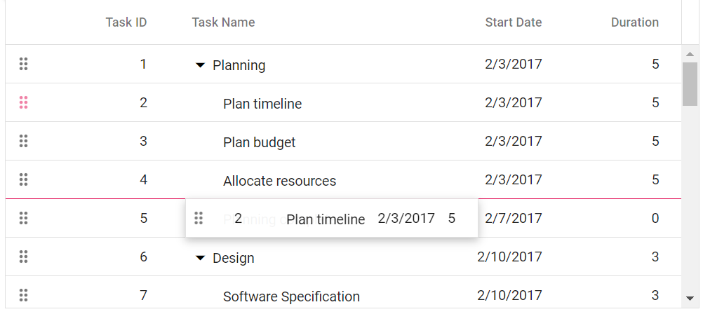
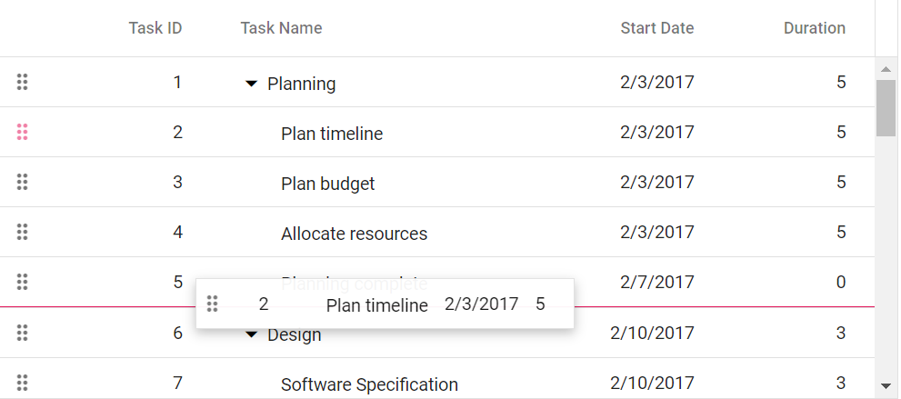
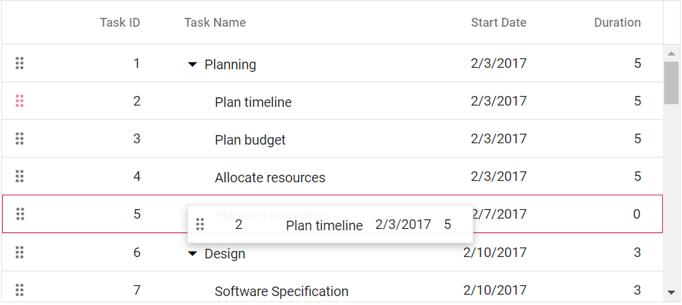

# Row drag and drop in Angular TreeGrid component

The Syncfusion Angular TreeGrid component provides built-in support for row drag and drop functionality. This feature allows you to easily rearrange rows within the tree grid by dragging and dropping them to new positions. Additionally, you can also drag and drop rows from one tree grid to another tree grid, as well as drag and drop rows to custom components.

To use the row drag and drop feature in TreeGrid component, you need to inject the **RowDDService** in the provider section of the **AppModule**. The **RowDDService** is responsible for handling the row drag and drop functionality in the TreeGrid component. Once you have injected the **RowDDService**, you can then use the [allowRowDragAndDrop](https://ej2.syncfusion.com/angular/documentation/api/treegrid/#allowrowdraganddrop) and [targetID](https://ej2.syncfusion.com/angular/documentation/api/treegrid/rowDropSettings/#targetid) properties to enable and configure the row drag and drop feature in the Tree Grid.

## Drag and drop within tree grid

The drag and drop feature allows you to rearrange rows within the tree grid by dragging them using a drag icon. This feature can be enabled by setting the [allowRowDragAndDrop](https://ej2.syncfusion.com/angular/documentation/api/treegrid/#allowrowdraganddrop) property to **true**. This property is a boolean value that determines whether row drag and drop is enabled or not. By default, it is set to **false**, which means that row drag and drop is disabled.

Here's an example of how to enable drag and drop within the tree grid:









  


> * The [`isPrimaryKey`](https://ej2.syncfusion.com/angular/documentation/api/treegrid/column/#isprimarykey) property is necessary to perform row drag and drop operation.

### Drag and drop rows without drag icons 

By default, when performing a drag and drop operation in the tree grid, drag icons are displayed. However, in some cases, you may want to hide these drag icons. This can be achieved by setting the [targetID](https://ej2.syncfusion.com/angular/documentation/api/treegrid/rowDropSettings/#targetid) property of the [rowDropSettings](https://ej2.syncfusion.com/angular/documentation/api/treegrid/rowDropSettings/) object to the current Tree Grid's ID.

By setting the `targetID`, the Tree Grid will render without a helper icon for row dragging. You can perform the drag and drop by directly using the row.

Here's an example of how to hide the drag and drop icon in the tree grid:




    




  


> * Enabling the selection feature in the Tree Grid allows for the selection of rows before initiating the drag-and-drop operation.
> * Multiple rows can be selected by clicking and dragging inside the tree grid. For multiple row selection, the [type](https://ej2.syncfusion.com/angular/documentation/api/treegrid/selectionSettings/#type) property must be set to **Multiple**.

## Different drop positions

In a Tree Grid, drag and drop functionality allows to rearrange rows to adjust their position. When dragging and dropping rows in a tree grid, you can drop rows into following positions:

1. Above
2. Below
3. Child

**Above**

If the border line appears at the top of the target row, which is **Task ID: 5** while dropping, then the row will be added `above` the target row as sibling.



**Below**

If the border line appears at the bottom of the target row, which is **Task ID: 5** while dropping, then the row will be added `below` the target row as sibling.



**Child**

If the border line appears at both top and bottom of the target row, which is **Task ID: 5** while dropping, then the row will be added as `child` to the target row.



## Drag and drop to another tree grid

The tree grid row drag and drop allows you to drag tree grid rows and drop to another tree grid. This feature can be enabled by setting the [allowRowDragAndDrop](https://ej2.syncfusion.com/angular/documentation/api/treegrid/#allowrowdraganddrop) property to **true** in the TreeGrid component. This property specifies whether to enable or disable the row drag and drop feature in the Tree Grid. By default, this property is set to **false**, which means that row drag and drop functionality is not enabled.

To specify the target component where the tree grid rows should be dropped, use the [targetID](https://ej2.syncfusion.com/angular/documentation/api/treegrid/rowDropSettings/#targetid) property of the [rowDropSettings](https://ej2.syncfusion.com/angular/documentation/api/treegrid/rowDropSettings/) object. The `targetID` property takes the ID of the target component as its value.

Here's an example code snippet that demonstrates how to enable row drag and drop another tree grid:









  


## Drag and drop to custom component 

The Tree Grid provides the feature to drag and drop tree grid rows to any custom component. This feature allows you to easily move rows from one component to another without having to manually copy and paste data. To enable row drag and drop, you need to set the [allowRowDragAndDrop](https://ej2.syncfusion.com/angular/documentation/api/treegrid/#allowrowdraganddrop) property to **true** and defining the custom component ID in the [targetID](https://ej2.syncfusion.com/angular/documentation/api/treegrid/rowDropSettings/#targetid) property of the `rowDropSettings` object. The ID provided in `targetID` should correspond to the ID of the target component where the rows are to be dropped.

In the below example, the selected tree grid row is dragged and dropped in to the Grid component by using [rowDrop](https://ej2.syncfusion.com/angular/documentation/api/treegrid/#rowdrop) event. Upon dropping the row into the Grid component, the corresponding Tree Grid row is removed, and its data is inserted into a custom component.









  


> * The `rowDrop` event is fired when a row is dropped onto a custom component, regardless of whether the drop is successful or not. You can use the `args.cancel` property to prevent the default action.

## Drag and drop with remote data binding  

In the TreeGrid component, you can perform row drag and drop operations using the remote data binding feature. This guide provides step-by-step instructions on how to carry out row drag and drop operations with remote data binding.

When implementing Row Drag and Drop with remote data in the TreeGrid, it's crucial to manage the server-side logic for handling the dragged record and its placement upon dropping. This involves adding and removing records at the server end based on the dragged record and drop position, typically within the [rowDrop](https://ej2.syncfusion.com/angular/documentation/api/treegrid/#rowdrop) event.

The tree grid row drag and drop has three drop positions:

•	**Above**: Drop a row above the target row.
•	**Below**: Drop a row below the target row.
•	**Child**: Drop a row as a child of the target row.

From the arguments of the `rowDrop` event, you can access the following details to handle row drag and drop operations on the server end:

•	Index of the dragged record from `args.FromIndex`
•	Data of the dragged record from `args.Data`
•	Drop index from `args.DropIndex`
•	Position from `args.Target.ID`

Using the above details and position, the dragged record can be efficiently removed from its original position and inserted into the new drop position on the server end. This process ensures seamless management of records during Row Drag and Drop with remote data binding.

```typescript

import { Component, ViewChild } from '@angular/core';
import { TreeGridComponent, ToolbarItems, EditSettingsModel } from '@syncfusion/ej2-angular-treegrid';
import { DataManager, UrlAdaptor } from '@syncfusion/ej2-data';
import { Ajax } from '@syncfusion/ej2-base'; 

@Component({
  selector: 'app-home',
  template: `<ejs-treegrid #treegrid [dataSource]='data' hasChildMapping='isParent'             idMapping='TaskId' (rowDrop)="rowDrop($event)" parentIdMapping='ParentId' 
  [allowRowDragAndDrop]=true [editSettings]="editSettings"  [toolbar]="toolbar" height="320">
  <e-columns>
    <e-column field='TaskId' headerText='Task ID' isPrimaryKey=true width='150'></e-column>
    <e-column field='TaskName' headerText='Task Name' width='150'></e-column>
    <e-column field='Duration' headerText='Duration' width='150' textAlign='Right'></e-column>
  </e-columns>
</ejs-treegrid>`
})
export class HomeComponent {
  @ViewChild('treegrid')
  public treegrid?: TreeGridComponent;
  public data?: DataManager;
  public editSettings?: EditSettingsModel;
  public toolbar?: ToolbarItems[];


  ngOnInit(): void {
    this.data = new DataManager({
      url: '/Home/UrlDatasource',
      adaptor: new UrlAdaptor()
    });

    this.editSettings = { allowEditing: true, allowAdding: true, allowDeleting: true,  };
    this.toolbar = ['Add', 'Edit', 'Delete', 'Update', 'Cancel', 'Search'];

  }
  public rowDrop(args: any) {
   
    var drag_idmapping = (this.treegrid as any).getCurrentViewRecords()[args.fromIndex][(this.treegrid as any).idMapping];
    var drop_idmapping = (this.treegrid as any).getCurrentViewRecords()[args.dropIndex][(this.treegrid as any).idMapping];
    var data = args.data[0];
    var positions = { dragidMapping: drag_idmapping, dropidMapping: drop_idmapping, position: args.dropPosition };
    const ajax = new Ajax({
      url: '/Home/MyTestMethod',
      type: 'POST',
      dataType: "json",
      contentType: 'application/json; charset=utf-8',
      data: JSON.stringify({ value: data, pos: positions })
    }); 
    ajax.send();
    ajax.onSuccess = (data: string) => {
      
    };
  }
}

```

Here's a code snippet demonstrating server-side handling of row drag and drop operations:

```typescript

        public ActionResult UrlDatasource([FromBody] DataManagerRequest dm)
        {
            IEnumerable DataSource = TreeGridItems.GetSelfData();
            DataOperations operation = new DataOperations();

            if (dm.Search != null && dm.Search.Count > 0)
            {
                DataSource = operation.PerformSearching(DataSource, dm.Search);  //Search 
            }
            if (dm.Sorted != null && dm.Sorted.Count > 0) //Sorting 
            {
                DataSource = operation.PerformSorting(DataSource, dm.Sorted);
            }
            if (dm.Where != null && dm.Where.Count > 0) //Filtering 
            {
                DataSource = operation.PerformFiltering(DataSource, dm.Where, dm.Where[0].Operator);
            }
            int count = DataSource.Cast<TreeGridItems>().Count();
            if (dm.Skip != 0)
            {
                DataSource = operation.PerformSkip(DataSource, dm.Skip);   //Paging 
            }
            if (dm.Take != 0)
            {
                DataSource = operation.PerformTake(DataSource, dm.Take);
            }
             return dm.RequiresCounts ? Ok(new { result = DataSource, count }) : Ok(DataSource);

        }
          
        //Here handle the code of row drag and drop operations
        public bool MyTestMethod([FromBody] ICRUDModel value)
        {
            if (value.pos.position == "bottomSegment" || value.pos.position == "topSegment")
            {
                //for bottom and top segment drop position. If the dragged record is the only child for a particular record,
                //we need to set parentItem of dragged record to null and isParent of dragged record's parent to false 
                if (value.value.ParentId != null) // if dragged record has parent
                {
                    var childCount = 0;
                    int parent1 = (int)value.value.ParentId;
                    childCount += FindChildRecords(parent1); // finding the number of child for dragged record's parent
                    if (childCount == 1) // if the dragged record is the only child for a particular record
                    {
                        var i = 0;
                        for (; i < TreeGridItems.GetSelfData().Count; i++)
                        {
                            if (TreeGridItems.GetSelfData()[i].TaskId == parent1)
                            {
                                //set isParent of dragged record's parent to false 
                                TreeGridItems.GetSelfData()[i].isParent = false;
                                break;
                            }
                            if (TreeGridItems.GetSelfData()[i].TaskId == value.value.TaskId)
                            {
                                //set parentItem of dragged record to null
                                TreeGridItems.GetSelfData()[i].ParentId = null;
                                break;
                            }


                        }
                    }
                }
                TreeGridItems.GetSelfData().Remove(TreeGridItems.GetSelfData().Where(ds => ds.TaskId == value.pos.dragidMapping).FirstOrDefault());
                var j = 0;
                for (; j < TreeGridItems.GetSelfData().Count; j++)
                {
                    if (TreeGridItems.GetSelfData()[j].TaskId == value.pos.dropidMapping)
                    {
                        //set drgged records parentItem with parentItem of
                        //record in dropindex
                        value.value.ParentId = TreeGridItems.GetSelfData()[j].ParentId;
                        break;
                    }
                }
                if (value.pos.position == "bottomSegment")
                {
                    this.Insert(value, value.pos.dropidMapping);
                }
                else if (value.pos.position == "topSegment")
                {
                    this.InsertAtTop(value, value.pos.dropidMapping);
                }
            }
            else if (value.pos.position == "middleSegment")
            {
                TreeGridItems.GetSelfData().Remove(TreeGridItems.GetSelfData().Where(ds => ds.TaskId == value.pos.dragidMapping).FirstOrDefault());
                value.value.ParentId = value.pos.dropidMapping;
                FindDropdata(value.pos.dropidMapping);
                this.Insert(value, value.pos.dropidMapping);
            }
            return true;
        }

        public ActionResult Insert([FromBody] ICRUDModel value, int rowIndex)
        {
            var i = 0;
            if (value.Action == "insert")
            {
                rowIndex = value.relationalKey;
            }
            Random ran = new Random();
            int a = ran.Next(100, 1000);
            
            for (; i < TreeGridItems.GetSelfData().Count; i++)
            {
                if (TreeGridItems.GetSelfData()[i].TaskId == rowIndex)
                {
                    value.value.ParentId = rowIndex;
                    if (TreeGridItems.GetSelfData()[i].isParent == false)
                    {
                        TreeGridItems.GetSelfData()[i].isParent = true;
                    }
                    break;

                }
            }
            i += FindChildRecords(rowIndex);
            TreeGridItems.GetSelfData().Insert(i, value.value);

            return Json(value.value);
        }

        public void InsertAtTop([FromBody] ICRUDModel value, int rowIndex)
        {
            var i = 0;
            for (; i < TreeGridItems.GetSelfData().Count; i++)
            {
                if (TreeGridItems.GetSelfData()[i].TaskId == rowIndex)
                {
                    break;

                }
            }
            i += FindChildRecords(rowIndex);
            TreeGridItems.GetSelfData().Insert(i - 1, value.value);
        }

        public void FindDropdata(int key)
        {
            var i = 0;
            for (; i < TreeGridItems.GetSelfData().Count; i++)
            {
                if (TreeGridItems.GetSelfData()[i].TaskId == key)
                {
                    TreeGridItems.GetSelfData()[i].isParent = true;
                }
            }
        }

        public int FindChildRecords(int? id)
        {
            var count = 0;
            for (var i = 0; i < TreeGridItems.GetSelfData().Count; i++)
            {
                if (TreeGridItems.GetSelfData()[i].ParentId == id)
                {
                    count++;
                    count += FindChildRecords(TreeGridItems.GetSelfData()[i].TaskId);
                }
            }
            return count;
        }
        public void Remove([FromBody] ICRUDModel value)
        {
            if (value.Key != null)
            {
                // TreeGridItems value = key;
                TreeGridItems.GetSelfData().Remove(TreeGridItems.GetSelfData().Where(ds => ds.TaskId == double.Parse(value.Key.ToString())).FirstOrDefault());
            }

        }
}

```

## Drag and drop events

The TreeGrid component provides a set of events that are triggered during drag and drop operations on the tree grid rows. These events allow you to customize the drag element, track the progress of the dragging operation, and perform actions when a row is dropped on a target element. The following events are available:

1. [rowDragStartHelper](https://ej2.syncfusion.com/angular/documentation/api/treegrid/#rowdragstarthelper): This event is triggered when a click occurs on the drag icon or a tree grid row. It allows you to customize the drag element based on specific criteria.

2. [rowDragStart](https://ej2.syncfusion.com/angular/documentation/api/treegrid/#rowdragstart): This event is triggered when the dragging of a tree grid row starts.

3. [rowDrag](https://ej2.syncfusion.com/angular/documentation/api/treegrid/#rowdrag): This event is triggered continuously while the tree grid row is being dragged.

4. [rowDrop](https://ej2.syncfusion.com/angular/documentation/api/treegrid/#rowdrop): This event is triggered when a drag element is dropped onto a target element.




import { Component, ViewChild, OnInit, ViewEncapsulation } from '@angular/core';
import { sampleData } from './datasource';
import { TreeGridComponent } from '@syncfusion/ej2-angular-treegrid';
import { RowDragEventArgs } from '@syncfusion/ej2-angular-grids';

@Component({
  selector: 'app-container',
  encapsulation: ViewEncapsulation.None,
  template: `<div style="text-align:center">
  <p style="color:red;" id="message">{{message}}</p>
  </div>
  <ejs-treegrid #treegrid id='TreeGrid'  [dataSource]='sourceData' childMapping='subtasks'  [allowPaging]="true" [pageSettings]="true" [allowSelection]="true" [allowRowDragAndDrop]="true" 
              [selectionSettings]="selectionOptions"  (rowDrop)="rowDrop($event)" (rowDragStartHelper)="rowDragStartHelper($event)" (rowDragStart)="rowDragStart($event)" 
            (rowDrag)="rowDrag($event)">
                <e-columns>
                  <e-column field='taskID' headerText='Task ID' [isPrimaryKey]='true'  textAlign='Right' width=90></e-column>
                  <e-column field='taskName' headerText='Task Name' textAlign='Left' width=180></e-column>
                  <e-column field='startDate' headerText='Start Date' textAlign='Right' format='yMd' width=90></e-column>
                  <e-column field='duration' headerText='Duration' textAlign='Right' width=80></e-column>
                </e-columns>
            </ejs-treegrid>  `,
  styles: [],
})
export class AppComponent implements OnInit {
  @ViewChild('treegrid')
  treeGridObject!: TreeGridComponent;
  public sourceData: Object[] = [];
  public selectionOptions?: Object;
  public message?: string;

  ngOnInit(): void {
    this.sourceData = sampleData;
    this.selectionOptions = { type: 'Multiple' };
  }
  rowDragStartHelper(args: RowDragEventArgs): void {
    this.message = `rowDragStartHelper event triggered`;
    if (((args.data as Object[])[0] as any).taskID === 4) {
      args.cancel = true;
    }
  }
  rowDragStart(args: RowDragEventArgs) {
    this.message = `rowDragStart event triggered`;
    if (((args.data as Object[])[0] as any).taskID === 7) {
      args.cancel = true;
    }
   
  }
  rowDrag(args: RowDragEventArgs): void {
    this.message = `rowDrag event triggered`;
  }
  rowDrop(args: RowDragEventArgs): void {
    this.message = `rowDrop event triggered`;
  }
}






  


## Perform row drag and drop action programmatically 

In the TreeGrid component, you can perform row drag and drop actions programmatically using the [reorderRows](https://ej2.syncfusion.com/angular/documentation/api/treegrid/#reorderrows) method. This method allows you to easily reorder rows by specifying the indices and the desired drop position.

**Parameters**

The reorderRows method accepts three parameters:

* **fromIndex:** The index of the row to be dragged.
* **toIndex:** The index where the row should be dropped.
* **position:** Specifies the drop position relative to the target row.

In the following example, using `click` event of an external button, row at index 1 is dropped **below** the row at index 3 by using the `reorderRows` method.









  


## Prevent reordering a row 

To prevent the default behavior of dropping rows onto the target by setting the `cancel` property to `true` in [rowDrop](https://ej2.syncfusion.com/angular/documentation/api/treegrid/#rowdrop) event argument.

In the following example, the drop action is cancelled using the `rowDrop` event of the tree grid.









  


### Prevent reordering a row as child to another row

To prevent the default behavior of dropping rows as children onto the target, set the `cancel` property to `true` in the [rowDrop](https://ej2.syncfusion.com/angular/documentation/api/treegrid/#rowdrop) event argument. Additionally, you can adjust the drop position after cancelling using the [reorderRows](https://ej2.syncfusion.com/angular/documentation/api/treegrid/#reorderrows) method.

In the following example, the drop action of the **Child** position is prevented, and the row is dropped **Above** the target row's position by using the `reorderRows` method.









  


## Limitations

* A single row can be dragged and dropped within the same tree grid without enabling row selection.
* The row drag and drop feature does not have built-in support for row template and detail template features of the tree grid.

## See also

[Sorting data in the Syncfusion Tree Grid](https://ej2.syncfusion.com/documentation/treegrid/sorting)
[Filtering data in the Syncfusion Tree Grid](https://ej2.syncfusion.com/documentation/treegrid/filtering/filtering)