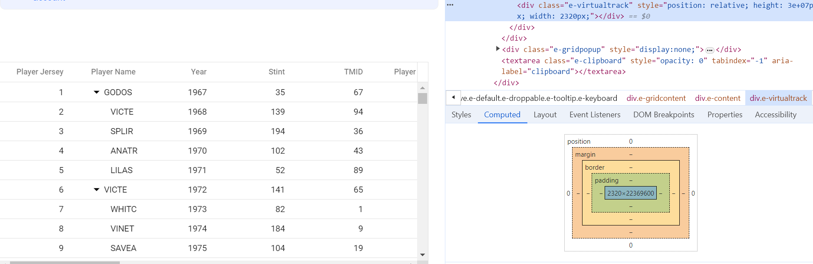
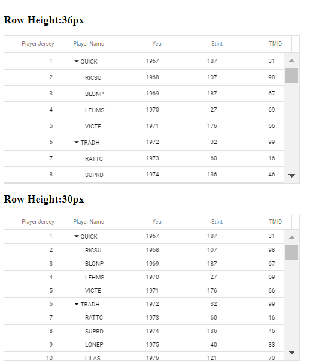

# Virtual scrolling in Angular TreeGrid component

Virtual scrolling in the TreeGrid component enables efficient rendering and interaction with large datasets by loading only the visible rows or columns in the viewport. This optimization drastically improves performance, reducing initial load time and memory usage, which is essential when working with thousands of records or columns.

To use virtualization in TreeGrid, inject the **VirtualScrollService**, which handles optimized data rendering and management for virtual scrolling scenarios.

## Row virtualization

Row virtualization ensures only the rows currently visible in the viewport are loaded and rendered, resulting in fast scrolling and minimal resource use. It replaces traditional paging by dynamically loading data as you scroll vertically.

Enable row virtualization by setting [enableVirtualization](https://ej2.syncfusion.com/angular/documentation/api/treegrid/#enablevirtualization) to **true** and defining the [height](https://ej2.syncfusion.com/angular/documentation/api/treegrid/#height) property on the TreeGrid.

The visible record count is determined by the TreeGrid’s height but can be explicitly set using the [pageSettings.pageSize](https://ej2.syncfusion.com/angular/documentation/api/treegrid/pageSettingsModel/#pagesize) property. Loaded data is cached and reused as necessary.

The following example demonstrates row virtualization using `enableVirtualization` property.












### Limitations 

* Row virtualization is not compatible with:
   1. Batch editing
   2. Checkbox selection
   3. Detail template
   4. Row template
   5. Rowspan
   6. Autofill

* The TreeGrid or its parent container must have a static height when using row virtualization. Setting height to 100% only works if the parent container has a defined height.
* Copy-paste and drag-and-drop are limited to items visible in the current viewport.
* Cell-based selection is not supported for row virtualization.
* Using variable row heights (e.g., with a template column) is not supported; all rows should have a uniform height.
* Maximum records are constrained by the browser’s element height limitation.
* Features that modify row height (such as text wrapping) are not supported with row virtualization.
* To increase row height for all rows, use custom CSS:
    ```css
    .e-treegrid .e-row {
        height: 2em;
    }
    ```

## Column virtualization

Column virtualization renders only columns currently visible in the viewport, supporting horizontal scroll for wide datasets. This is crucial for applications with many columns, improving initial load and scroll performance.

To enable column virtualization, you need to set the [enableColumnVirtualization](https://ej2.syncfusion.com/angular/documentation/api/treegrid/#enablecolumnvirtualization) property of the tree grid to **true**. This configuration instructs the tree grid to only render the columns that are currently visible in the viewport. 

The following example demonstrates column virtualization using `enableColumnVirtualization`  property.












> Column's [width](https://ej2.syncfusion.com/angular/documentation/api/treegrid/column/#width) is required for column virtualization. If column's width is not defined then tree grid will consider its value as **200px**.

### Limitations 

* While using column virtual scrolling, column width should be in pixel. Percentage values are not accepted.
* Selected column details are only retained within the viewport. When the next set of columns is loaded, the selection for previously visible columns is lost.
* The cell selection is not supported for column virtual scrolling.
* The **Ctrl + Home** and **Ctrl + End** keys are not supported when using column virtual scrolling.
* The following features are compatible with column virtualization and works only within the viewport:
   1. Column resizing
   2. Column reordering
   3. Auto-fit
   4. Print
   5. Clipboard
   6. Column menu - Column chooser, AutofitAll

* Column virtual scrolling is not compatible with the following feature
    1. Colspan
    2. Batch editing
    3. Checkbox selection
    4. Column with infinite scrolling
    5. Stacked header
    6. Row template
    7. Detail template
    8. Autofill
    9. Column chooser

## Browser height limitation in virtual scrolling and solution

You can load millions of records in the tree grid by using virtual scrolling, where the tree grid loads and renders rows on-demand while scrolling vertically. As a result, tree grid lightens the browser’s load by minimizing the DOM elements and rendering elements visible in the viewport. The height of the tree grid is calculated using the Total Records Count * [Row Height](https://ej2.syncfusion.com/angular/documentation/api/treegrid/#rowheight) property.

The browser has some maximum pixel height limitations for the scroll bar element. The content placed above the maximum height can't be scrolled if the element height is greater than the browser's maximum height limit. The browser height limit affects the virtual scrolling of the tree grid. When a large number of records are bound to the tree grid, it can only display the records until the maximum height limit of the browser. Once the browser's height limit is reached while scrolling, the user won't able to scroll further to view the remaining records.

For example, if the row height is set as 30px and the total record count is 1000000(1 million), then the height of the tree grid element will be 30,000,000 pixels. In this case, the browser's maximum height limit for a div is about 22,369,600 (The maximum pixel height limitation differs for different browsers). The records above the maximum height limit of the browser can't be scrolled.

This height limitation is not related to the TreeGrid component. It fully depends on the default behavior of the browser. The same issue is reproduced in the normal HTML table too.

The following image illustrates the height limitation issue of a normal HTML table in chrome browsers.


TreeGrid component also faced the same issue as mentioned in the below image.



The Tree Grid has an option to overcome this limitation of the browser in the following ways.

### Solution 1: Using external buttons

You can prevent the height limitation problem in the browser when scrolling through millions of records by loading the segment of data through different strategy.

In the following sample, tree grid is rendered with a large number of records(nearly 2 million). Here, you can scroll 0.5 million records at a time in tree grid. Once you reach the last page of 0.5 million records, the **Load Next Set** button will be shown at the bottom of the tree grid. By clicking that button, you can view the next set of 0.5 million records in tree grid. Also, the **Load Previous Set** button will be shown at the top of the tree grid to load the previous set of 0.5 million records.

Let's see the step by step procedure for how we can overcome the limitation in the TreeGrid component.

1. Create a custom adaptor by extending UrlAdaptor and binding it to the tree grid DataSource property. In the processQuery method of the custom adaptor, we handled the Skip query based on the current page set to perform the data operation with whole records on the server.

    ```typescript
        class CustomUrlAdaptor extends UrlAdaptor {
            processQuery(args) {
                if (arguments[1].queries) {
                    for (const i = 0; i < arguments[1].queries.length; i++) {
                        if (arguments[1].queries[i].fn === 'onPage') {
                            // pageSet - defines the number of segments going to split the 2million records. In this example 0.5 million records are considered for each set so the pageSet is 1, 2, 3 and 4.
                            // maxRecordsPerPageSet – In this example the value is define as 0.5 million.

                            // gridPageSize – the pageSize defined in the Grid as pageSettings->pageSize property

                            // customize the pageIndex based on the current pageSet (It send the skip query including the previous pageSet ) so that the other operations performed for total 2millions records instead of 0.5 million alone.
                            arguments[1].queries[i].e.pageIndex = (((pageSet - 1) * maxRecordsPerPageSet) / gridPageSize) + arguments[1].queries[i].e.pageIndex;
                        }
                    }
                }
                let original = super.processQuery.apply(this, arguments);
                return original;
            }
        }
        this.data = new DataManager({
            adaptor: new CustomUrlAdaptor(),
            url: "Home/UrlDatasource"
        });
    ```

2. Render the tree grid by define the following features.

    ```typescript
        <ejs-treegrid #grid [dataSource]='data' idMapping='taskID' parentIdMapping='parentID' hasChildMapping='isParent' [enableVirtualization]='true' [pageSettings]='pageSettings' [height]='360' (beforeDataBound)='beforeDataBound($event)' >
            <e-columns>
                <e-column field='taskID' headerText='Task ID' textAlign='Right' width=100></e-column>
                ......
                ......  
            </e-columns>
        </ejs-treegrid>
    ```

3. In the beforeDataBound event, we set the args.count as 0.5 million to perform scrolling with 0.5 million records and all the data operations are performed with whole records which is handled using the custom adaptor. And also particular segment records count is less than 0.5 million means it will directly assigned the original segmented count instead of 0.5 million.

    ```typescript
        beforeDataBound(args) {
            // storing the total records count which means 2 million records count
            totalRecords = args.count;

            // change the count with respect to maxRecordsPerPageSet (maxRecordsPerPageSet = 500000)
            args.count = args.count - ((pageSet - 1) * maxRecordsPerPageSet) > maxRecordsPerPageSet ?maxRecordsPerPageSet : args.count - ((pageSet - 1) * maxRecordsPerPageSet);
        }
    ```

4. Render “Load Next Set” button and “Load Previous Set” button at bottom and top of the grid component.

    ```typescript
        <button ejs-button cssClass="e-info prevbtn" (onClick)="prevBtnClick($event)" content="Load Previous Set..."></button>

        <ejs-treegrid #grid [dataSource]='data' idMapping='taskID' parentIdMapping='parentID' hasChildMapping='isParent' [enableVirtualization]='true' [pageSettings]='pageSettings' [height]='360' (beforeDataBound)='beforeDataBound($event)' >
            <e-columns>
                <e-column field='taskID' headerText='Task ID' textAlign='Right' width=100></e-column>
                ......
                ......  
            </e-columns>
        </ejs-treegrid>

        <button ejs-button cssClass="e-info nxtbtn" (onClick)="nxtBtnClick($event)" content="Load Next Set..."></button>
    ```

5. While click on the `Load Next Set` / `Load Previous Set` button corresponding page data set is loaded to view remaining records of total 2 millions records after doing some simple calculation.

    ```typescript
        // Triggered when clicking the Previous/ Next button.
        prevNxtBtnClick(args) {
            if (grid.element.querySelector('.e-content') && grid.element.querySelector('.e-content').getAttribute('aria-busy') === 'false') {
                // Increase/decrease the pageSet based on the target element.
                pageSet = args.target.classList.contains('prevbtn') ? --pageSet : ++pageSet;
                this.rerenderGrid(); // Re-render the Grid component.
            }
        }
    ```

> If you perform tree grid actions such as filtering, sorting, etc., after scrolling through the 0.5 million data, the tree grid performs those data actions with the whole records, not just the current loaded 0.5 million data.

### Solution 2: Using rowHeight

Lower the [rowHeight](https://ej2.syncfusion.com/angular/documentation/api/treegrid/#rowheight) property to fit more rows within the browser limit. If height is still exceeded, use Solution 1 or enable paging.
In the following image, you can see how many records will be scrollable when setting rowHeight to "36px" and "30px".



### Solution 3: Using paging instead of virtual scrolling

Similar to virtual scrolling, the [paging](https://ej2.syncfusion.com/angular/documentation/treegrid/paging/) feature also loads the data in an on-demand concept. Pagination is also compatible with all the other features in tree grid. So, use the paging feature instead of virtual scrolling to view a large number of records in the tree grid without any kind of performance degradation or browser height limitation.

## See also

* [Load on demand with virtualization in TreeGrid.](https://www.syncfusion.com/blogs/post/load-on-demand-and-virtualization-in-essential-js-2-treegrid)
* [Boosting TreeGrid Performance with Virtualization](https://www.syncfusion.com/blogs/post/boosting-javascript-tree-grid-performance-virtualization)