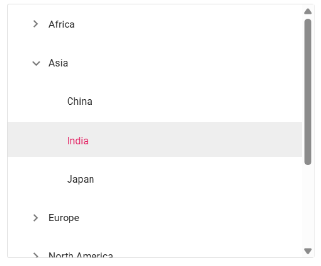
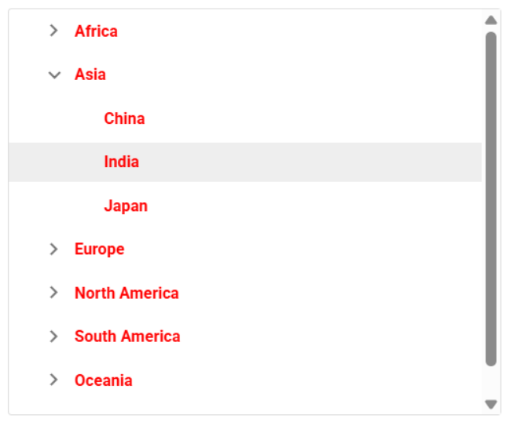
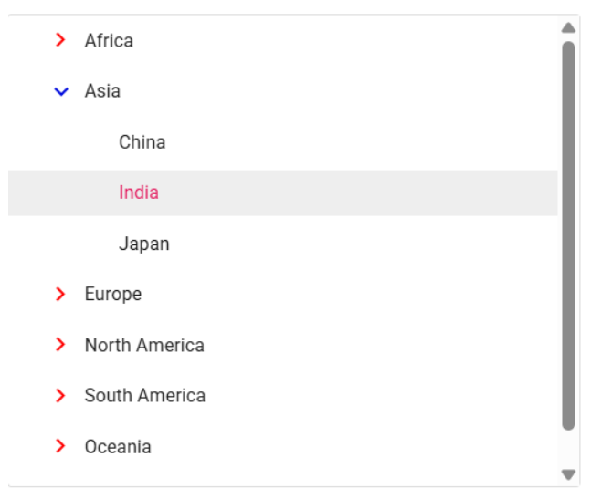
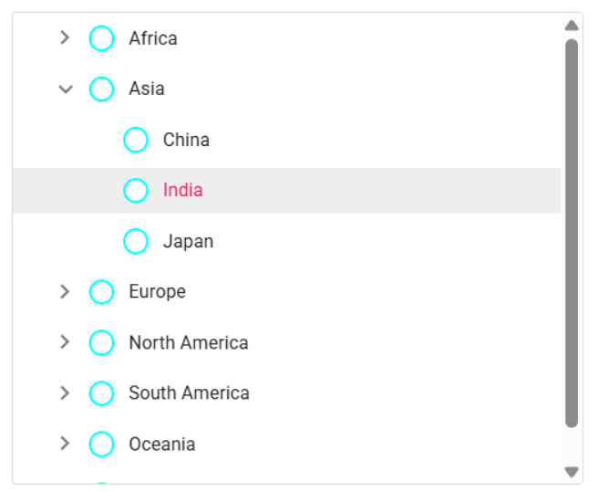
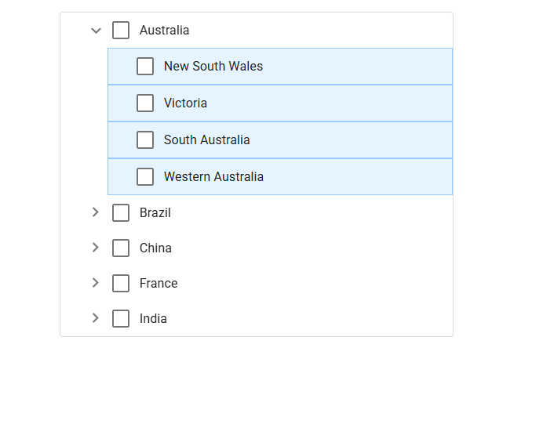

# Styles and Appearance in Angular TreeView Component

The following content provides the exact CSS structure that can be used to modify the component's appearance based on the user preference.

## Customizing the height of TreeView nodes

Use the following CSS to customize the TreeView nodes.

```css
.e-treeview .e-list-item { 
        line-height: 45px; 
} 
.e-treeview .e-fullrow { 
        height: 45px; 
}
```


## Customizing the text of TreeView nodes

Use the following CSS to customize the text of TreeView nodes.

```css
.e-treeview .e-list-text { 
        font-weight: bold;
        color:yellow !important;
} 
```


## Customizing the TreeView expand and collapse icons

Use the following CSS to customize the TreeView expand and collapse icons.

```css
.e-treeview .e-icon-expandable { 
        color: red; 
} 
.e-treeview .e-icon-collapsible { 
        color: black; 
}
```


## Customizing the TreeView checkboxes

Use the following CSS to customize the TreeView checkboxes.

```css
.e-checkbox-wrapper .e-frame {
    border:aqua solid 2px !important;
    border-radius: 50% !important;
}
.e-checkbox-wrapper:hover .e-frame{
    border:black solid 2px !important;
    border-radius:50% !important;
}
```


## Customizing the TreeView nodes based on levels

Use the following CSS to customize the TreeView nodes based on levels.

```css
.e-treeview .e-level-2 > .e-text-content { 
     background: #E6F4FF;
     border: 1px solid #99C9FF;
} 
```


## Customizing the TreeView using HtmlAttributes

The [htmlAttributes](https://ej2.syncfusion.com/angular/documentation/api/treeview/fieldssettingsmodel#htmlattributes) property of the TreeView component allows you to define a mapping field for applying custom HTML attributes to individual TreeView nodes.

By using attributes, you can customize specific nodes effectively. For instance, in the given example, a 'child-node' class is added to a specific node, allowing you to customize the corresponding node via CSS.

```css
.child-node {
  font-weight: bold;
  background-color: aqua;
}
```














  
