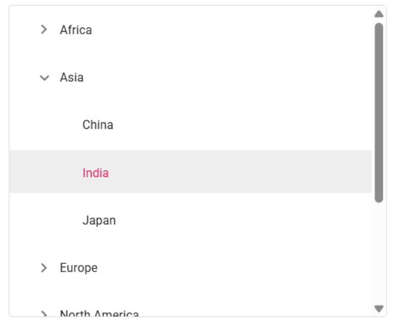
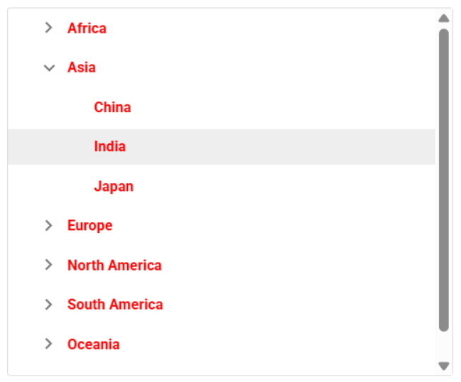
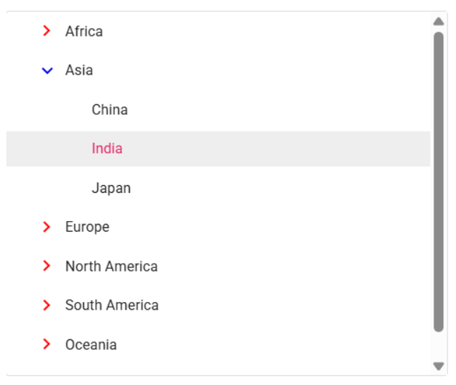
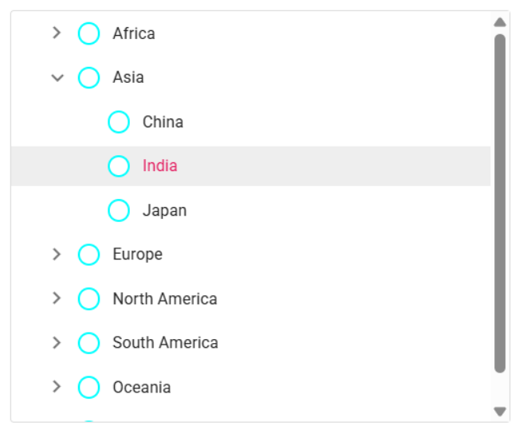
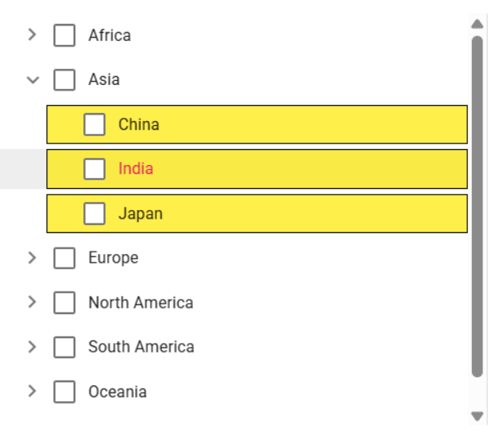

# Styles and Appearance in Angular Tree View

The following CSS classes can be overridden to customize the appearance of the TreeView component. Each section demonstrates a single customization with the CSS rule and a sample screenshot of the result.

> Most of the TreeView's internal selectors are prefixed with `e-`. To override them reliably, place your CSS **after** the Syncfusion theme stylesheet in your `angular.json` build configuration. When the component's default styles use higher specificity, append `!important` to your custom rule.

## Customizing the height of TreeView nodes

Use the following CSS to customize the TreeView nodes.

```css
.e-treeview .e-list-item { 
        line-height: 45px; 
} 
.e-treeview .e-fullrow { 
        height: 45px; 
        display: block; 
}
```


## Customizing the text of TreeView nodes

Use the following CSS to customize the text of TreeView nodes.

```css
.e-treeview .e-list-text { 
        font-weight: bold;
        color: #b88600 !important;
        background-color: #fffbe6;
} 
```


## Customizing the TreeView expand and collapse icons

Use the following CSS to customize the TreeView expand and collapse icons.

```css
.e-treeview .e-icon-expandable { 
        color: red; 
} 
.e-treeview .e-icon-collapsible { 
        color: black; 
}
```


## Customizing the TreeView checkboxes

Use the following CSS to customize the checkboxes once they are enabled in the component.

```css
.e-checkbox-wrapper .e-frame {
    border:aqua solid 2px !important;
    border-radius: 50% !important;
}
.e-checkbox-wrapper:hover .e-frame{
    border:black solid 2px !important;
    border-radius:50% !important;
}
```


## Customizing the TreeView nodes based on levels

Use the following CSS to customize the TreeView nodes based on levels.

```css
.e-treeview .e-level-2 > .e-text-content { 
     background: #E6F4FF;
     border: 1px solid #99C9FF;
} 
```


## Customizing the TreeView using HTML Attributes

The [htmlAttributes](https://ej2.syncfusion.com/angular/documentation/api/treeview/fieldssettingsmodel#htmlattributes) property of the TreeView component allows you to define a mapping field for applying custom HTML attributes to individual TreeView nodes. The mapping field references a property in each node's data record whose value contains the HTML attributes that should be applied to that node.

For example, the following data shape maps a `nodeProperty` field to `htmlAttributes` so the component can read per-node HTML attributes from the data:

```typescript
public field: Object = {
  dataSource: this.localData,
  id: 'id',
  text: 'name',
  parentID: 'pid',
  htmlAttribute: 'nodeProperty'
};

public localData = [
  { id: '1', name: 'Parent', nodeProperty: { class: 'parent-node' } },
  { id: '2', name: 'Child', pid: '1', nodeProperty: { class: 'child-node' } }
];
```

By using these attributes, you can customize specific nodes. In the next example, a `child-node` class is added to a specific node and styled using the CSS below.

```css
.child-node {
  font-weight: bold;
  background-color: aqua;
}
```














  


## See Also

* [Syncfusion<sup style="font-size:70%">&reg;</sup> Angular Theme Builder](https://ej2.syncfusion.com/angular/documentation/appearance/theme-studio/)
  
