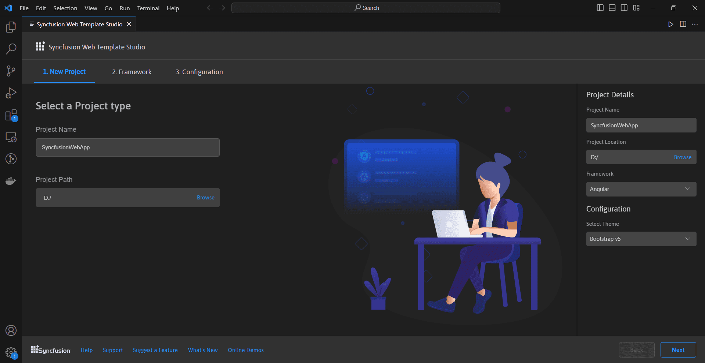
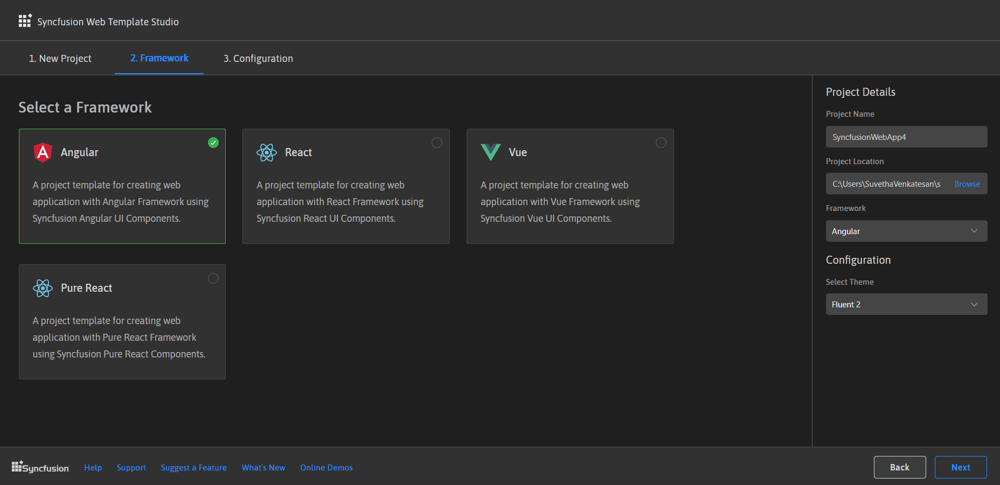
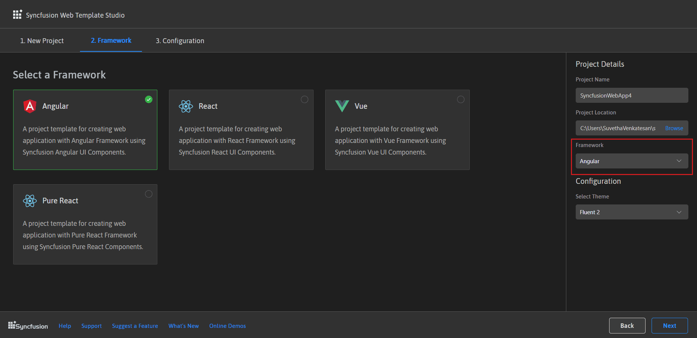
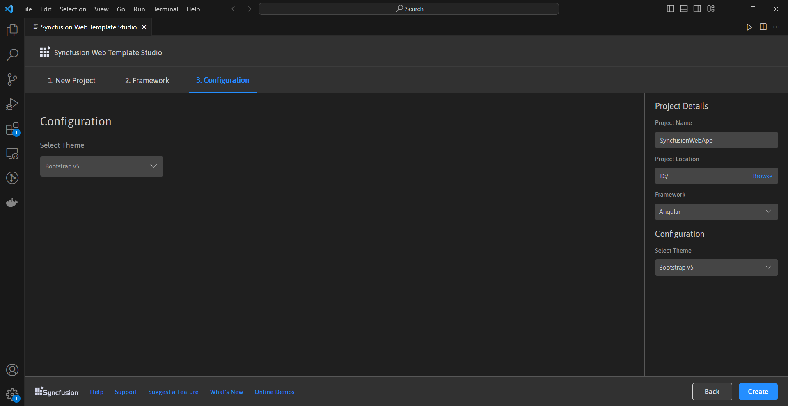
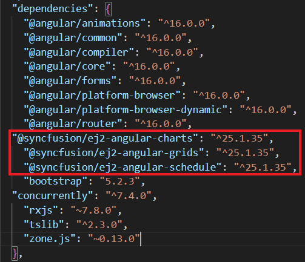
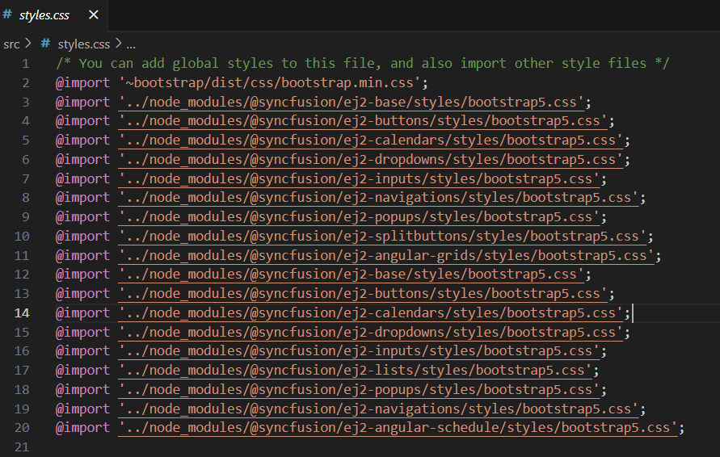
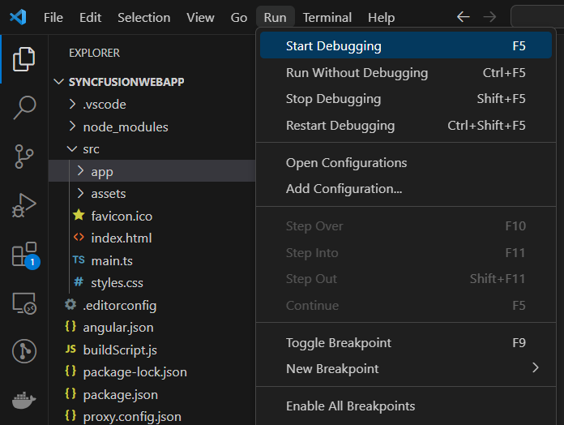

# Visual Studio Code Extensions

## Create project

Syncfusion&reg; provides **project templates** for **Visual Studio Code** to simplify the creation of Syncfusion&reg; web applications. These templates generate applications using the selected framework (React, Pure React, Angular, or Vue), automatically add the required Syncfusion NPM packages, and include sample code for Grid, Chart, and Scheduler components along with relevant styles for a seamless development process.

   > The Syncfusion&reg; Visual Studio Code project template provides support for Web project templates from v18.3.0.47.

Follow the instructions below to create a **Syncfusion web application** using **Visual Studio Code:**

1. In Visual Studio Code, open the command palette by pressing **Ctrl+Shift+P**. In the palette, search for "Syncfusion" to list the available templates.

    

2. Select **Syncfusion Web Template Studio: Launch** and press Enter. The Template Studio wizard will appear for configuring the Syncfusion&reg; web app. Enter the Project Name and Path, then choose one of the supported frameworks (React, Pure React, Angular, or Vue) for your new application.

    

3. Click either **Next** or **Framework** tab, the Framework types will be appearing and choose any one of the Framework:
   * Angular
   * React
   * Pure React
   * Vue

    

    If you select the Angular framework, it will appear in the **Project Details** section. You can proceed to configure and create the Angular application.

    

4. Click **Next** or go to the **Configuration** tab. In the Configuration section, select a theme and click **Create** to generate the project.

    

5. The created Syncfusion&reg; Web App is configured with the Syncfusion&reg; NPM packages, styles, and the component render code for the Syncfusion&reg; component added.

    

    

    

## Run the application

1. Click on **F5** or navigate to **Run>Start debugging**

    

2. Once the compilation finishes, open the localhost link in your browser to view the output.

    