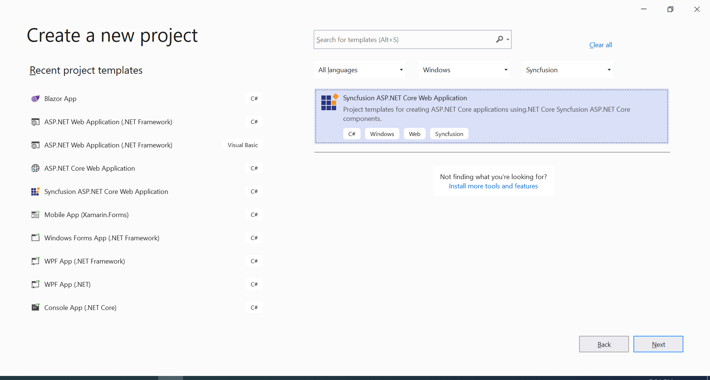
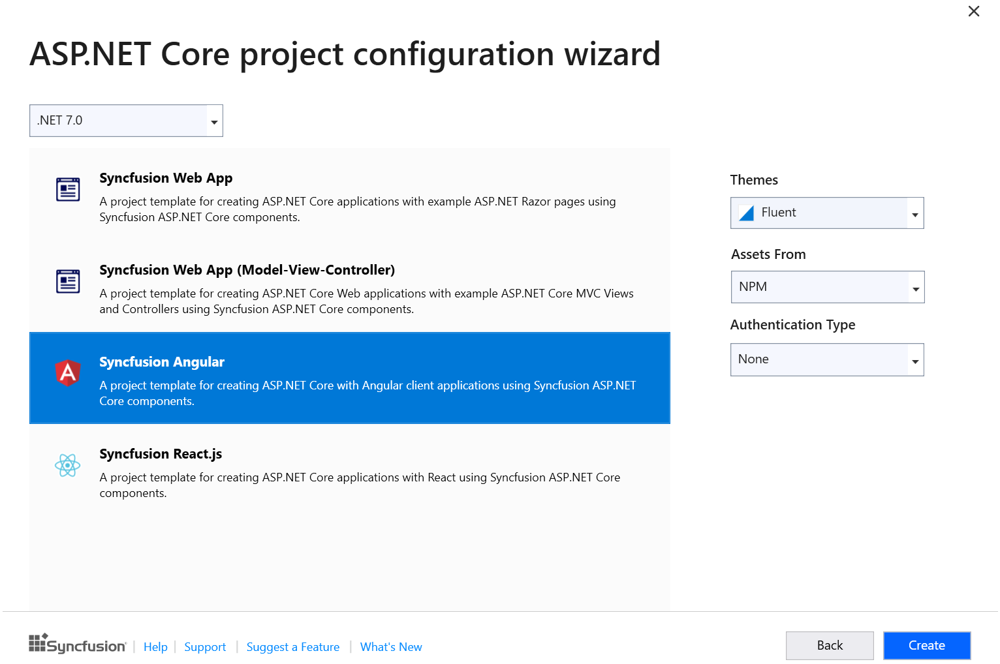

# Visual Studio Extensions

## Create project

Syncfusion&reg; provides the **Visual Studio Project Templates** for create the Syncfusion&reg; Angular Application. The Syncfusion&reg; Angular application creates the application with the required Syncfusion&reg; references, namespaces and CDN links for making the development earlier with the Syncfusion&reg; components.

> Syncfusion&reg; Angular project templates are available from v17.1.0.47.

Follow these steps to create a Syncfusion&reg; Angular application using Visual Studio:

1. Open Visual Studio 2022.

2. To create a Syncfusion&reg; Angular project, follow either one of the options below:
  
    **Option 1:**

      Choose the **Extension->Syncfusion-> Essential Studio for ASP.NET Core -> Create New Syncfusion Project…** in Visual Studio menu.

      

      > In Visual Studio 2017, the **Syncfusion** menu appears directly in the Visual Studio menu.

     **Option 2:**

      Select **File > New > Project**. In the New Project dialog, filter the project type with "Syncfusion" or use the **Syncfusion** keyword in the search bar to find templates provided by Syncfusion&reg; for ASP.NET Core.

      

      > In Visual Studio 2017, choose **File > New > Project** and navigate to **Syncfusion > .NET Core > Syncfusion ASP.NET Core Web Application**.

3. Select the **Syncfusion ASP.NET Core Web Application** template and click **Next**.

    

4. Name the Project, choose the destination location and then click Create button. The Syncfusion&reg; ASP.NET Core project configuration wizard appears.

    

    Choose the Syncfusion&reg; Angular template and choose required theme, authentication type and asset.

    > Syncfusion&reg; Angular project template available from .NET 6.0 and .NET 7.0

5. Click the Create button, the Syncfusion&reg; Angular application has been created.

6. The created Syncfusion&reg; Angular application configured with Syncfusion&reg;.

7. The required Syncfusion&reg; Angular NPM packages, scripts, and selected styles are included in the created Angular application.
