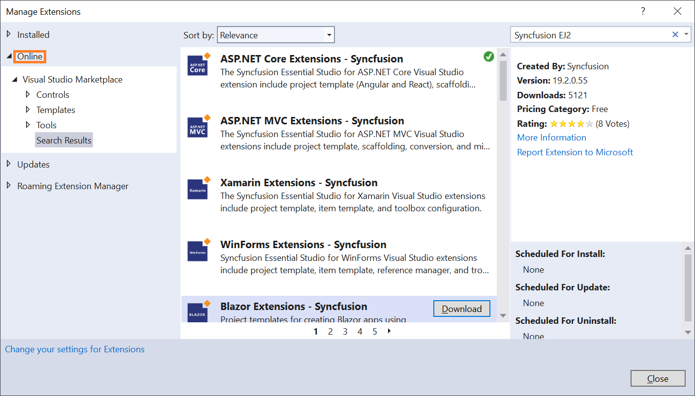
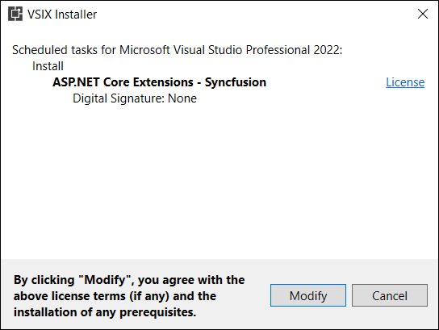
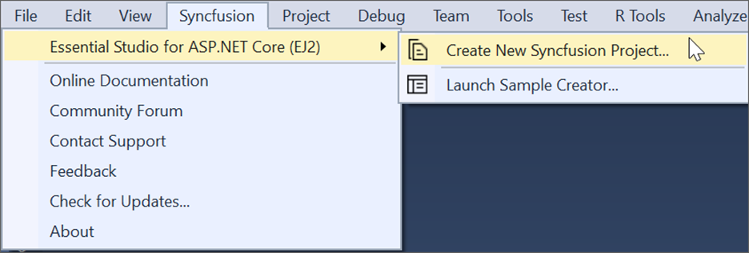
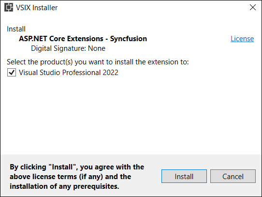

# Download and Installation

Syncfusion&reg; publishes its Visual Studio extension in the Visual Studio Marketplace. You can install the extension directly within Visual Studio or download and install it from the Marketplace using the appropriate link:

- [Visual Studio 2022](https://marketplace.visualstudio.com/items?itemName=SyncfusionInc.ASPNETCoreVSExtensions)
- [Visual Studio 2019 or earlier](https://marketplace.visualstudio.com/items?itemName=SyncfusionInc.ASPNETCoreExtensions)

## Prerequisites

Ensure that the following prerequisites are installed before using the Syncfusion&reg; ASP.NET Core extension. These are required for creating projects, adding snippets, converting, or upgrading Syncfusion&reg; ASP.NET Core applications:

* [Visual Studio 2022 or later](https://visualstudio.microsoft.com/downloads)
* [.NET Core 6.0 or later](https://dotnet.microsoft.com/en-us/download/dotnet)

## Install via Visual Studio Manage Extensions

Follow these steps to install the Syncfusion&reg; ASP.NET Core extensions from Visual Studio's Manage Extensions:

1. Open Visual Studio.

2. Navigate to **Extensions → Manage Extensions**.

    > In Visual Studio 2017, go to **Tools → Extensions and Updates**.

3. In the Manage Extensions window, click the **Online** tab and type **"Syncfusion EJ2"** into the search box.

    

4. Click the **Download** button for **ASP.NET Core Extension - Syncfusion**.

5. Close all Visual Studio instances to begin the installation process. The VSIX installer prompt appears.

    

6. Click the **Modify** button to install the extension.

7. After installation completes, launch Visual Studio.

8. The Syncfusion&reg; extensions are now available from the **Extensions** menu.

    

    > In Visual Studio 2017, the Syncfusion&reg; menu may appear directly in the main Visual Studio menu.

## Install from the Visual Studio Marketplace

To install the Syncfusion&reg; ASP.NET Core extension from the Visual Studio Marketplace:

1. Download the relevant extension for your Visual Studio version:
   - [Visual Studio 2022](https://marketplace.visualstudio.com/items?itemName=SyncfusionInc.ASPNETCoreVSExtensions)
   - [Visual Studio 2019 or earlier](https://marketplace.visualstudio.com/items?itemName=SyncfusionInc.ASPNETCoreExtensions)

2. Close all running instances of Visual Studio.

3. Double-click the downloaded VSIX file to launch the installer. The VSIX installer prompts you to select the Visual Studio version(s) in which to install the extension.

    

4. Click **Modify** to proceed with installation.

5. After installation, launch Visual Studio. The Syncfusion&reg; extensions are accessible from the **Extensions** menu.

    

    > In Visual Studio 2017, the Syncfusion&reg; menu may appear directly in the main Visual Studio menu.
